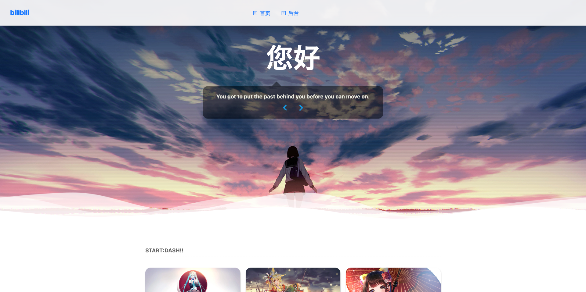
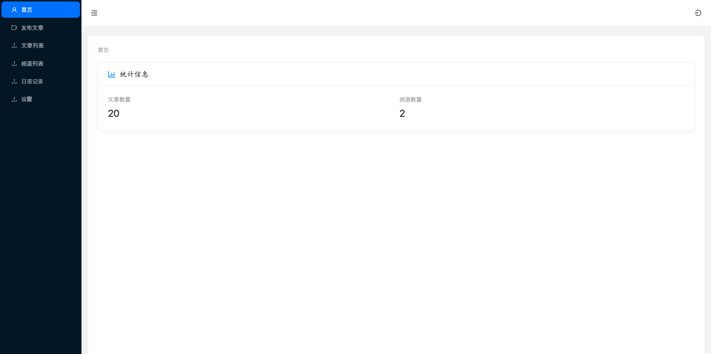
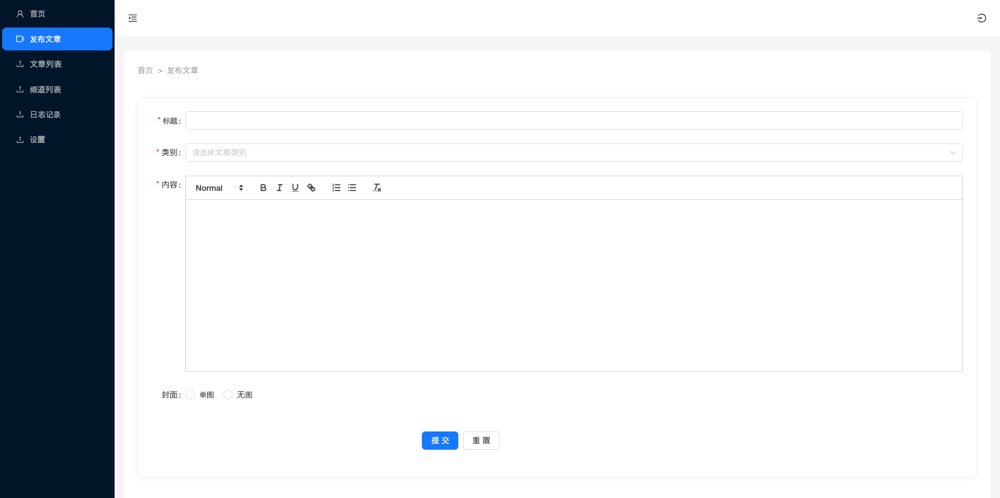
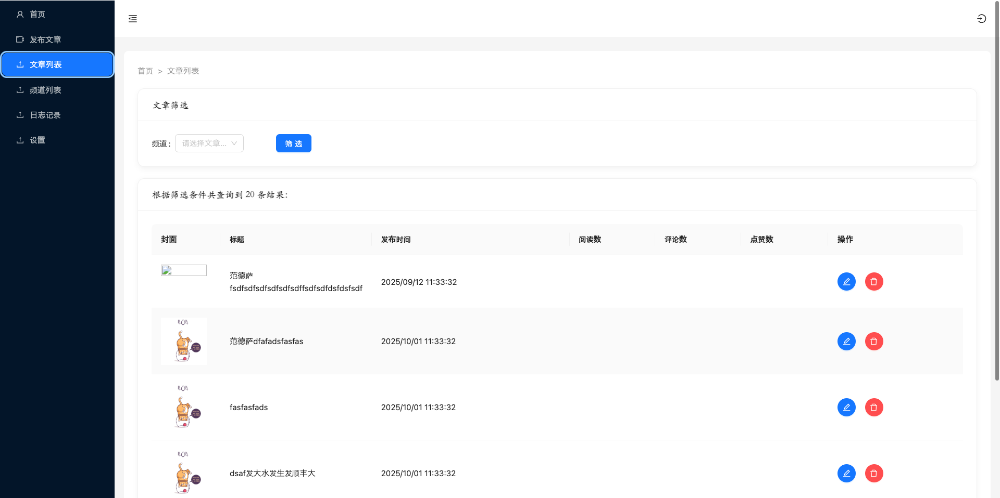
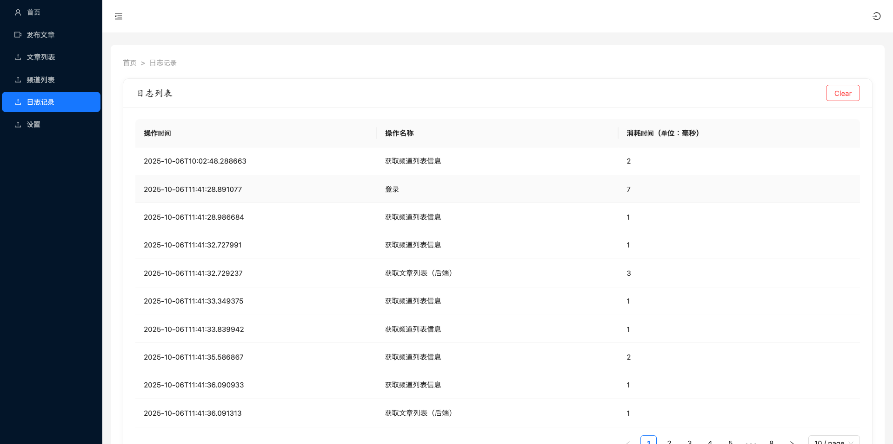

# 个人博客 （前后端分离）

## 前言

该个人博客是[之前博客](https://github.com/liuweixu/blogsakura)的基础上，将后端框架express改为SpringBoot+MyBatis等，
并且对url方式进行调整，改为RESTful方式。

其中，frontend为前端文件所在地，里面已删除express等文件。其余文件为Java的SpringBoot框架文件所在地。

## 介绍

前端界面主要参考[Sakura](https://2heng.xin/)和[theme-react-sakura](https://github.com/open-snail/theme-react-sakura)。

后端界面主要以antd进行搭建。后端开发中，主要使用SpringBoot和MyBatis，侧重于与mysql进行增删改查等操作。

## 技术栈

### 前端

React（19版本）、TypeScript/JavaScript、Nodejs、Antd、Shadcn/ui、HTML、CSS、MySQL、Tailwind CSS等。

### 后端

SpringBoot、MyBatis、MySQL、Java、JUnit、Sa-Token

## 界面介绍

### 前端界面

搭建该个人博客的初衷有多个：

1. 为了丰富简历。
2. 对[Sakura](https://2heng.xin/)这个很早就很喜欢，想着有机会搞一个类似的。
3. [theme-react-sakura](https://github.com/open-snail/theme-react-sakura)
   虽然已经用react搭建，但是有的架构比较老，而且使用的css方式我觉得比较麻烦（即使用js文件直接用styled.div方式保存css），查看和修改不太方便，

所以我之前开始使用React和TypeScript借鉴[Sakura](https://2heng.xin/)
和[theme-react-sakura](https://github.com/open-snail/theme-react-sakura)搭建简单的demo版本个人博客。

不过也因为是demo版本，有很多架构是没有搭建完成，目前初步完成的界面：

- 首页
- 文章页

以后有时间会慢慢完善的。

### 后端界面

后端界面直接使用antd组件库搭建的，目前已完成：

- 首页
- 文章列表页
- 发布文章页
- 频道列表页
- 日志记录页

## 整个系统特点

1. 前后端分离部署，保证数据安全，遵循当下开发的流行原则。
2. 可直接查看前端的首页和文章页。可通过登录后，查看后台界面。
3. 新增AOP注解实现日志管理。
4. 采用 Restful 风格的 API。
5. 引入随机图片API，实现背景的随机更换。
6. 引入Sa-Token和全局异常机制，对请求进行统一拦截和管理，并实现一定程度的权限控制。
7. 前端程序使用React、TypeScipt等，后端使用SpringBoot、MyBatis、Sa-Token
   等，代码清晰易懂，方便初学者学习。
8. 阅读数等高频数值使用Redis缓存，并针对冷数据采取一定的过期策略处理，保证系统的稳定性。

## 使用方式

1. 先拷贝下载程序：

```
git clone git@github.com:liuweixu/blogsakura.git
```

2. 进入文件夹和使用npm安装

```
cd blogsakura
npm install
```

3. 运行
   首先直接运行BlogsakuraJavaApplication.java，然后运行前端界面：

```
npm run dev
```

# 界面示意图

## 前端



## 后端










# 未来改进计划

## 前端

- [ ] 添加个人介绍页
- [ ] 处理富文本，让图片也能显示

## 后端

- [ ] 处理首页，学习添加Echart
- [ ] 引入Nacos，更方便管理配置
- [ ] 引入Elastic Search，实现全文的搜索。

# 感谢

- [antd](https://ant.design/components/overview-cn/)
- [TypeScipt菜鸟教程](https://www.runoob.com/typescript/ts-tutorial.html)
- [React官方文档](https://react.docschina.org/)
- [vite官方文档](https://cn.vite.dev/guide/#scaffolding-your-first-vite-project)
- [黑马React笔记](https://blog.csdn.net/2301_80182418/article/details/145483587)
- [Sa-Token官方文档](https://sa-token.cc/)
- [SpringBoot中文文档](https://springdoc.cn/spring-boot/)
- [さくらの白猫](https://2heng.xin/theme-sakura/)

# 补充：技术栈选择说明

### antd

前端界面上有的是使用shadcn-ui，但是在后端上，我最后还是使用antd，因为shadcn-ui比较自由，方便自定义，
在前端也许比较适合，但是在后端界面的比较固定的搭建风格来看，使用shadcn-ui就不如使用antd更加方便快捷，
因为antd不仅更成熟，而且可以即插即用。

### Sa-Token

现在比较流行的Java的权限管理有：Spring Security、Shiro、Sa-Token等，其中，Spring Security
尽管和SpringBoot十分适配，但是配置过于繁琐，用在个人博客项目中有点杀鸡焉用牛刀的感觉，而Shiro也有
类似的现象。

最后，我选择Sa-Token是因为该框架有中文文档，并且很轻量，只需要几行代码就可以实现权限控制，尽管有些方面
可能存在一定的问题，但是在个人博客上已经足够了。

### SpringBoot+MyBatis

[之前博客](https://github.com/liuweixu/blogsakura)使用express和nodejs。不过因为express和nodejs尽管比较轻量，但是写起来有时候容易造成程序过于耦合，
不符合“高内聚低耦合”的思维，所以我后来改用SpringBoot和MyBatis。


